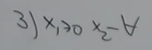
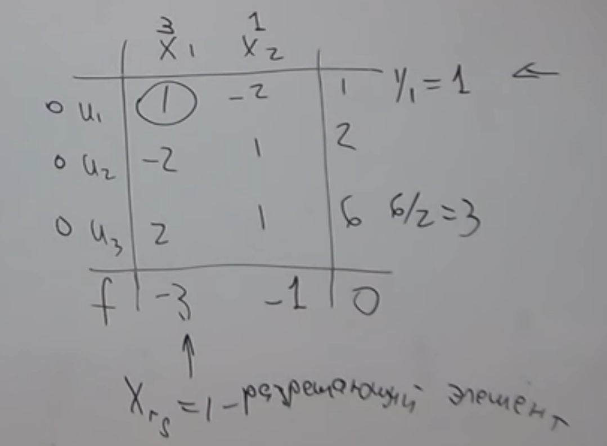
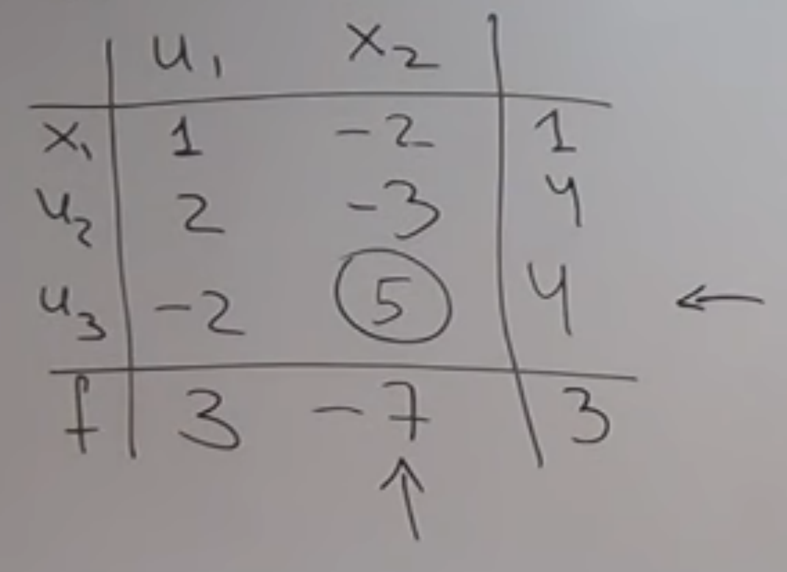
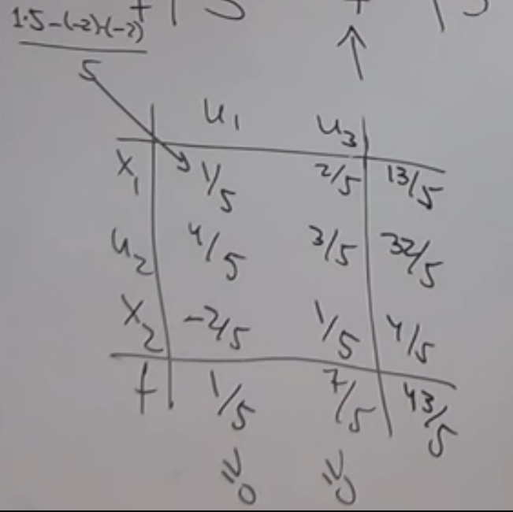

# Симплекс метод
### [ <u>Ссылка на источник статьи </u> ](https://youtu.be/B4hdkK5lMEg?si=4vZzjWgQfhF5Zh_z)

В отличии от графического метода он так же применим к случаям когда больше двух переменных

Так же существует модифицировнный симпллекс метод и метод искуственного базиса.

Поэтому Симплекс метод куда более универсален

# ГЛАВЫ

### #0 [Каноническая форма это:](#Каноническая-форма-это:)
* [Её условия](#Её-условия-это)
* [Пример Канонической Формы](#Пример-Канонической-Формы)

### #1 [Приведение к канонической форме](#Что-делать-если-задача-не-в-канонической-форме?)
* [Если задача на min](#Если-задача-на-min)
* [Если ограничение со знаком <= или >=](#Если-ограничение-со-знаком-<=)
* [Если ограничений на переменную нет](#Если-ограничений-на-переменную-нет)

### #2 [Пример Задачи #1](#Пример-Задачи-#1)
* [Транспонирование матрицы](#Начинаем-построение-симплекс-таблицы)
* [Фотка первой симплекс-таблицы](#Финальная-первая-симплекс-таблица)
* [Вне таблички](#Вне-таблички)
* [Внутрь таблички](#Внутрь-таблички)
* [Считаем строку оценок](#Как-это-сделать?)

### #3 [В случае отрицательной оценки](#Переходим-к-другой-таблице)
* [Нахождение разрешающего элемента](#Как-улучшить-эту-таблицу?)
* [Жаданово преобразование](#Жаданово-преобразование)
* [Финальная вторая симплекс-таблица](#Финальная-вторая-симплекс-таблица)

### #4 [Построение третей симплекс-таблицы](#Построение-третей-симплекс-таблицы)
* [Фотка третей таблицы](#Фотка-третей-таблицы)
* [Конец](#Конец)

### #5 [Подсумируем действия](#Подсумируем-действия)

## Каноническая форма это:
`F(x) = (c,x) -> max` // иногда к канон форме относят и задачу на `min`

Ограничения задаються ситемой равенств:
{

    Ax = b  // пример ограничения

    x >= 0  // не отрицательность вектора `x`
}
*Это называеться задачей в канонической форме*

### Её условия это:

**#1** Целевая функция должна стремиться к `max`

**#2** `x1>=0, x2>=0`

**#3** `b>=0` Иначе не имеет решения // читаеться как Б'ите

**#4** Надо привести все ограничения к виду не `<= `или `>=` а к `=`

### Пример Канонической Формы:
`F(x) = 2x1 - x2 + 5x3 -> max`
{

    -x1 + 10x2 = 1
    2x1 - 3x2 + x3 = 11
    x1>=0, x2>=0
}

### Пример Превой Стандартной Формы:
`F(x) = (c,x) -> max`
{

    Ax<=b
    x>=0
}

### Пример Второй Стандартной Формы:
`F(x) = (c,x) -> min`
{

    Ax<=b
    x>=0
}

## Что делать если задача не в канонической форме?

### Если задача на min
`F(x) = 2x1 + 15x2 - x3 -> min`
Тогда рассматриваем вспомогательную функцию где всё домножено на **-1**

`F1(x) = -2x1 - 15x2 + x3 -> max`
{
    Fmin* = -Fmax*
}

#### Продолжаем рассматривать нашу Каноническую задачу
[ <u>Переход на ДАНО нашей задачи</u> ](#Пример-Канонической-Формы:)

А мы продолжим её решать прямо тут

### Если ограничение со знаком <=
{

    -x1 + 10x2 <= 1 // надо ввести доп. переменную

    -x1 + 10x2 + u1 = 1 // назовём её `u1`
    
    u1>=0 // и требуем её не отрицательности
} 
*Иногда в качестве дополнительных переменных которые позволяют от* **ограничений неравенства** *перейти к* **ограничениям равенста** *выбирают следующие по индексу переменные* `x`. Например `x4,x5`

### Если ограничение со знаком >=
{

    2x1 - 3x2 + x3 >= 5 // Значит надо вычесть доп. переменную

    2x1 - 3x2 + x3 - u2 = 5 // назовём её u2
    u2>=0 // и требуем её не отрицательности
}

### Если ограничений на переменную нет

Знак того что может быть любое значение.
Тогда представляем `x2` как разницу двух не отрицательных чисел
{

    x2 = u3 - u4
    u3>=0, u4>=0
}

#### Рассмотрим нашу Каноническую задачу но пример с <= и >=
[ <u>Переход к Обычной версии</u> ](###Пример-Канонической-Формы:)

`F(x) = 2x1 - x2 + 5x3 -> max`
{

    -x1 + 10x2 <= 1

    2x1 - 3x2 + x3 >= 11

    x1>=0, x2>=0
}

Вообще должен быть такой вид но люди просто используют обычную и говорят что у u1, u2 коэфициенты равны нулю 
`F1(x) = 2x1 - x2 + 5x3 0*u1 + 0*u2 -> max`
{

    -x1 + 10x2 + u1 <= 1

    2x1 - 3x2 + x3 - u2 >= 11

    x1>=0, x2>=0

    u1>=0, u2>=0
}

# Пример Задачи #1
`F(x) = 3x1 + x2 -> max`
{

    x1 - 2x2 <= 1
    -2x1 + x2 <= 2
    2x1 + x2 <= 6
    x1>=0, x2>=0
}

В ней всё канонично кроме знаков `=`

Добавляем новые переменные.

Их понадобиться столько, сколько у нас не хватает знаков `=`. В нашем случае **3**.

Поэтому добавляем переменные u1,u2,u3.
`F(x) = 3x1 + x2 -> max`
{

    x1 - 2x2 + u1 < 1
    -2x1 + x2 + u2 < 2
    2x1 + x2 + u3 < 6
    x1>=0, x2>=0
}
*Числа справа образовывают вектор* `(1,2,6)` *и убедились что он положительный. Если вектор отрицательный то решения нет*

#### Начинаем построение симплекс-таблицы
Для этого мы составляем матрицу A

*Просто смотрим на коэфициенты в наших ограничениях с учётом новых добавленых* `u`

A =
{

    (x1, x2, u1, u2, u3)
    (1,  -2, 1,  0,  0 )
    (-2, 1,  0,  1,  0 )
    (2,  1 , 0,  0,  1 )
}

Теперь нам надо найти линейно независимый набор столбцов.

*что то типо фигуры где все значения 0 или 1*

В данном случае образующий столбцы единичной матрицы.
{

    (1,  0,  0 )
    (0,  1,  0 )
    (0,  0,  1 )
}

Эти переменные называються базисными.
`u1, u2, u3` - базисные переменные
`x1, x2` - не базисные переменные

## Финальная первая симплекс-таблица

На ней мы будем рассматривать примеры 

### Вне таблички
Кол-во **не базисных** переменных это кол-во **столбцов**.
Кол-во **базисных** переменных это кол-во **рядков**.

В нижнем левом углу записывется `f` // функция цели

### Внутрь таблички 
Мы записываем значения не базисных переменных

Справа мы записываем правую часть ограничений // то что идёт после равно

**Теперь нам нужно пересчитать строку оценок** // нижняя часть таблички
#### Как это сделать?
Сначала смотрим на целевую функцию, тоесть сюда `F(x) = 3x1 + x2 -> max`.

И надписываем значения коэфициентов возле переменных в таблице

**Как получить оценку?**

По формуле - берём коэфициенты возле этих переменных и вставляем в эту формулу:

`(u1*[0,0]) + (u2*[0,1]) + (u3*[0,2]) - x1` 

// `[x,y]` позиция числа внутри таблицы.

Зная это, вот наша формула для поиска первой оценки

`(0*1) + (0*-2) + (0*2) - 3` // = -3

Для второй оценки формула: `(u1*[1,0]) + (u2*[1,1]) + (u3*[1,2]) - x2` 

`(0*-2) + (0*1) + (0*1) - 1` // = -1

Последний столбец точно так же лишь с той разницей что вычитать нечего

#### Так мы составили начальную симплексную таблицу
Она задаёт опорное значение.

Если его выписать то:

`x0 = (0;0;1;2;6)`

Для не базисных переменных значение равно нулю. Для базисных оно равно самому правому числу

*Если подставить опорное значение в целевую функцию то мы увидим что* `F = 0`

### Переходим к другой таблице
Проверяя эту на оптимальность.

#### Критерием оптимальности
Являеться не отрицательность оценок.

Как только задача окажеться оптимальной. Её решение будет найдено 

Пока что наше опорное решение не являеться оптимальным 

#### Как улучшить эту таблицу?
Надо выбрать *разрешающий элемент*

Выбираеться он в 2 этапа.

Выбираеться столбец где самое маленькое отрицательное число.

Для строчки мы составляем симплексные отношения

Это деление самого правого числа на первое внутринее число

// ВАЖНО: только на отрицательные // `x` зависит от того какой столбец мы выбрали 

`[3,0] / [x,0]` // 1/1 = 1

`[3,1] / [x,1]` // отрицательное

`[3,2] / [x,2]` // 6/2 = 3

#### Разрешающий элемент
Он стоит на пересечении строки и стобца
У нас это `1`

*Его мы обводим кружочком*

Назовём его `z` - разрешающий элемент

При помощи него производиться жаданово преобразование симплексной таблицы что приводит к новому опорному решению

#### Жаданово преобразование
*Все действия выполняються со старой таблицой и в новую записываеться лишь результат*

**#1** `x1 <-> u1`
Меняються местами базисная и не базисная переменная у `z` Всё остальное не меняеться.

**#2** `z^-1` Решающий элемент оборачиваеться

**#3** `[z,...] / z` Все элементы главной строки деляться на `z`

**#4** `([...,z] / z) * -1` Все элементы главного столбца деляться на `z` и меняют знак

**#5** `[x,x]' = (z * [x,x] - [z,x] * [x,z]) / z` Умножение навхрест с отниманием произведений и делением на глав. элемент // Штрих это значение в новой табличке

Пятым пунктом считаем все оставшиеся элементы.

## Финальная вторая симплекс-таблица

Мы видим что у нас после преобразований ещё есть отрицательный элемент. Значит продолжаем повторять проверку на оптимальность пока не найдём решение.

[ <u>Переход в начало процедуры избавления от минусовой оценки</u> ](###Переходим-к-другой-таблице)

## Построение третей симплекс-таблицы
При переходе от одной симплексной-таблицы к другой, для задачи на **max**. Значение в самом правом нижнем углу - растёт. Оно уменьшиться не может. Метод расчитан на то что с каждым переходом к новой таблице мы приближаем значение целевой функции к максимуму.

Найти в ней `z` не сложно потому что у нас лишь одно число в оценках отрицательное. И лишь одно положительное в строчках.

Находим новый вектор который назовём `x1` Найдём мы его смотря на дальние элементы от переменных. `x1,x2,u1,u2,u3`.

Ещё раз напомню что базисные переменные это те которые стоят с самого лева. А не базисные это с самого верха.

Смотрим значения мы по дальним клетках у базисных переменных. А у не базисных значение равно нулю.

Результат: `x1 = (1,0,0,4,4)`

Мы можем Сделать проверку результата. Подставляем значения `x1,x2` у нас это `1,0` в целевую функцию и убеждаемся. что результат действительно равен 3.

`F(x) = 3 * 1 + 1 * 0` // 3

Вспоминаем шаги построения новой таблицы. У нас уже есть `z` значит начинаем [ <u>Жаданово преобразование</u> ](#Жаданово-преобразование)

## Фотка третей таблицы
Вот какую таблицу мы получаем на выходе

На ней ещё раз написана формула по которой мы ищем элементы внутри таблицы.

На ней мы нашли все значения. И даже значения базисных переменных которые будут составлят решение

Мы нашли наши оценки и видим что они положительные. Значит решение оптимально.

Записываем оптимальное решение, где результат назовём `x*`.

`x* = (13/5; 4/5; 0; 32/5; 0)`

 Значение целевой функции это `f*` 

Оно равно: `f* = 43/5`

*И СРАЗУ ЖЕ СЕБЯ ПРОВЕРЯЕМ*

Подставляем `x1,x2` в целевую функцию:

`f* = 3*(13/5) + 4/5` // 43/5

Всё совпадает - значит все преобразования мы провели правильно 

Значит `x*` - оптимальное решение

А значение `f*` - максимум для нашей целевой функции

### Конец
Решение найдено.

## Подсумируем действия
**Которые надо выполнить для решения симплекс методом:**

**#1** Приводим задачу к каноническому виду

**#2** Выписываем матрицу ограничений

**#3** Выбираем набор базисных переменных // там где 0,1,0,1,0

**#4** Базисные переменные мы записываем в первый столбец

**#5** Не базисные записываем вверх

**#6** Внутрь таблицы записываем столбцы соответсвующие не базисным переменным

**#7** В последний столбец записываються правые части ограничений

**#8** Выписываем коэфициенты

**#9** [ <u>Считаем строку оценок</u> ](#Как-это-сделать?)

**#10** Проверяем оптимальность/*на отрицательное число в оценках*

**#10.1** Задача решена. Смотреть #17.

**#11** Если нет то строим новую симплекс-таблицу

**#12** Выбираем разрешающий элемент `z`

**#13** Сначала выбираеться столбец по методу найбольшее отрицательное

**#14** Строчку методом положительного числа и [ <u>соотношения</u> ](#Как-улучшить-эту-таблицу?)

**#15** Переходим к новой таблице через [ <u>Жаданово преобразование</u> ](#Жаданово-преобразование)

**#16** Повторяем до тех пор пока не получим все позитивные оценки.

**#17** В случае оптимальности

**#17.1** Значение опорного решения `x*` которое `x* = (x1,x2,u1,u2,u3)`

**#17.2** Значение целевой функции `f*` которое самое правое нижнее число 

**#18** Наш ответ это `x1,x2` из `x*` и значение `f*`

# [Вернуться в самое начало](#Симплекс-Метод)
